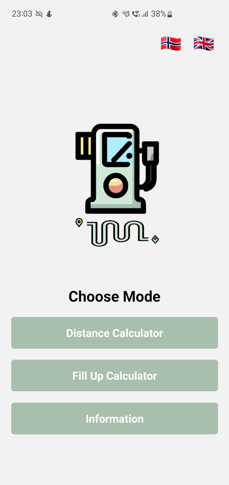
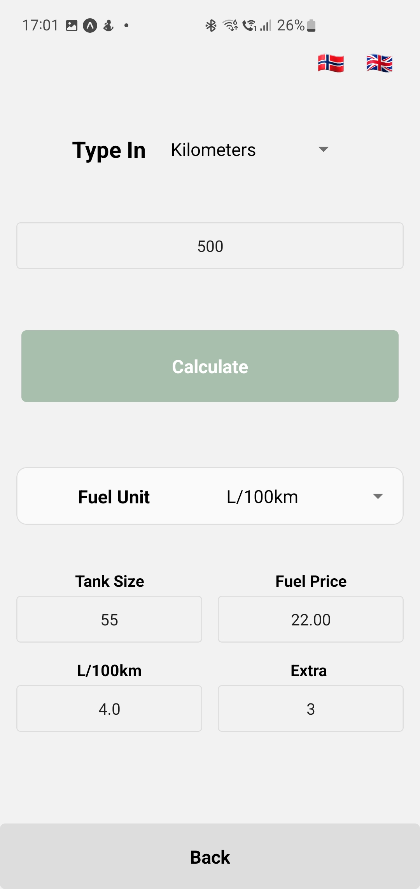
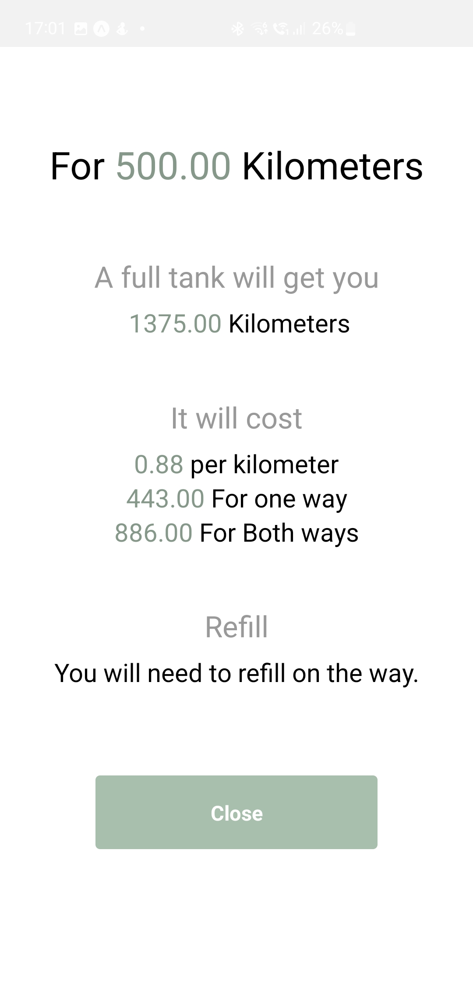
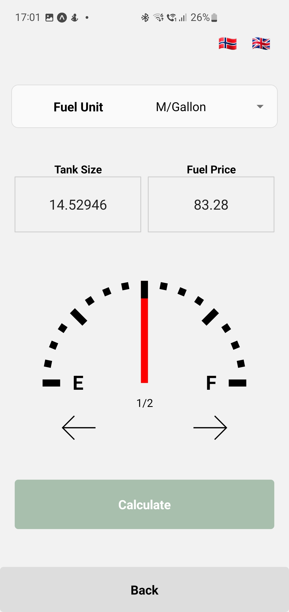
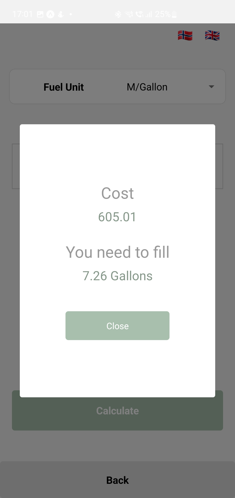

  

# FillUp-n-Fuel
A very simple app calculating fuel cost for a certain distance and how much it will cost to fill up the tank. 

# Screenshots

  
  
  
  
  

# License
[GNU General Public License v3.0](https://github.com/ThuWorkshop/FillUp-n-Fuel/blob/31c118058fe5653f293d79648785af0ccbbcef97/LICENSE)

# Privacy Policy
[Privacy Policy](https://github.com/ThuWorkshop/FillUp-n-Fuel/blob/31c118058fe5653f293d79648785af0ccbbcef97/privacyPolicy.md)
